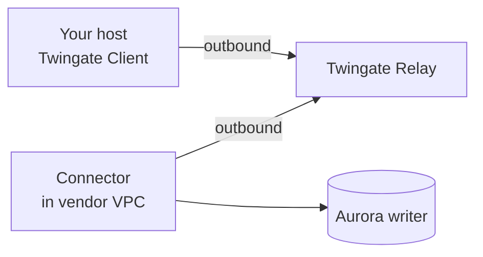
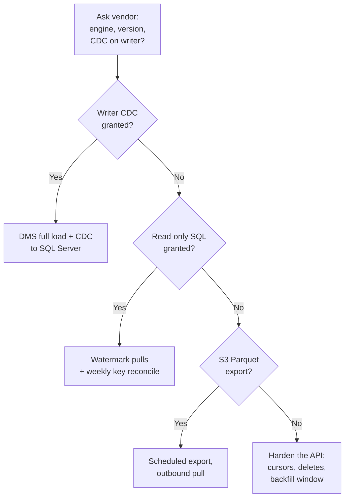

# Aurora → On-Prem Sync: Architecture Options

2026-09-17 · @Someone

## The fork: what the vendor grants decides everything

Every option below is downstream of one question — will the vendor let you connect to the Aurora **writer** instance? Log-based CDC on Aurora requires the writer on both engines. This is not a limitation you can tune around.

For Aurora MySQL, AWS states: "You can't use Aurora MySQL replicas as a source for AWS DMS unless your DMS migration task mode is Migrate existing data—full load only" ([DMS MySQL source](https://docs.aws.amazon.com/dms/latest/userguide/CHAP_Source.MySQL.html)). Aurora reader instances do not maintain their own binary logs, so this constrains every binlog-based tool, not just DMS — Snowflake's Openflow MySQL connector carries the identical restriction.

For Aurora PostgreSQL, AWS is blunter: "PostgreSQL 16 added support for logical decoding from read replicas. This feature isn't supported on Aurora PostgreSQL" ([Aurora logical replication](https://docs.aws.amazon.com/AmazonRDS/latest/AuroraUserGuide/AuroraPostgreSQL.Replication.Logical.html)). Flagging a genuine doc conflict: the DMS PostgreSQL source page describes read-replica CDC generically for "PostgreSQL" and never excludes Aurora. The Aurora engine guide governs.

So the request is not "give us a read replica." It is: enable row-based binlog or logical replication on your production writer, and let us hold a replication slot against it. On Aurora PostgreSQL a stalled slot causes WAL to accumulate on the vendor's writer until storage fills. That is what they will push back on, and the concern is legitimate — your design needs an answer for it.

| Access tier | Enables | Forecloses |
| --- | --- | --- |
| Writer + CDC parameters enabled | DMS, Debezium, Openflow, native logical replication; sub-minute lag; hard deletes captured | Nothing |
| Read-only SQL on reader endpoint, no CDC | Full load; watermark-based incremental pulls | Hard-delete detection; true real-time; capture of in-place updates without an updated-at column |
| API only (today's state) | Whatever the API exposes | Referential consistency, deletes, schema fidelity, bulk throughput |
| No direct access, batch handoff | Vendor exports snapshots to S3 as Parquet; you pull outbound-only | Any freshness better than the export cadence |

The fourth row is worth keeping alive as a fallback. Aurora supports `start-export-task` to write a cluster snapshot to S3 in compressed Parquet, and the target bucket may live in a different AWS account ([snapshot export docs](https://docs.aws.amazon.com/AmazonRDS/latest/AuroraUserGuide/aurora-export-snapshot.html)). It is the lowest-trust option for the vendor and the lowest-effort for your network team.

## What to ask the vendor for

Ask these before designing anything further. Every answer changes the build, and two of them (engine and version) are cheap for them to answer and expensive for you to guess wrong.

1. **Engine and exact version.** Aurora MySQL-Compatible or Aurora PostgreSQL-Compatible, and the version string. This is not cosmetic — Snowflake's Openflow MySQL connector supports Aurora MySQL 8.0 (Aurora v3) and explicitly **does not support 8.4** ([Openflow MySQL](https://docs.snowflake.com/en/user-guide/data-integration/openflow/connectors/mysql/about)). Aurora PostgreSQL below 2.6.x lacks pglogical, and Aurora PostgreSQL 2.1 and older are full-load only for DMS.
2. **Will you enable CDC parameters on the writer?** For MySQL: `binlog_format=ROW` and `binlog_row_image=FULL` in the DB *cluster* parameter group, plus `CALL mysql.rds_set_configuration('binlog retention hours', 24)`. Note `binlog_format` is dynamic but only applies to new sessions — AWS recommends restarting the database or the writing application, or you will silently keep getting `MIXED`-format logs from existing sessions. For PostgreSQL: `rds.logical_replication=1` in the cluster parameter group, which is **static and requires a reboot**; AWS then sets `wal_level`, `max_wal_senders`, `max_replication_slots` and `max_connections` for you ([DMS PostgreSQL source](https://docs.aws.amazon.com/dms/latest/userguide/CHAP_Source.PostgreSQL.html)).
3. **What grants will the replication user get?** MySQL needs `REPLICATION CLIENT`, `REPLICATION SLAVE` on `*.*` and `SELECT` on the schema. PostgreSQL needs the `rds_superuser` and `rds_replication` roles — `rds_superuser` is a large ask and the vendor may balk; AWS documents a non-master-user path that requires helper objects created from the master account.
4. **How will you expose the endpoint?** Their options, roughly in order of how defensible they are: a PrivateLink resource configuration shared to your AWS account; Site-to-Site VPN or Transit Gateway into your network; a publicly accessible cluster with security-group allowlisting plus forced TLS; SSM port forwarding through a bastion in their VPC. Section 8 covers what each demands.
5. **What is the total size and the largest tables?** Determines whether the bulk load is a dump-and-restore or a snapshot-to-S3 export.
6. **Retention and slot monitoring.** If they grant logical replication, who watches for a stalled slot, and what is the agreed WAL threshold at which they drop your slot to protect production? Get this in writing before you build. A dropped slot means a full reseed.
7. **Is there a schema contract?** What notice do you get before a DDL change? DMS does not replicate `DROP TABLE` or `RENAME TABLE` on MySQL sources, and column-nullability changes are not propagated to SQL Server targets.

If the answer to (2) is no, skip straight to Section 5. If the answer to (4) is "we won't expose the database at all," skip to Section 6 and start negotiating for the S3 Parquet handoff instead.

## Phase 1: bulk historical load and archive

Treat the archive and the warehouse as two separate artifacts. The archive is an immutable, engine-neutral copy you can still read in ten years. The warehouse is a queryable mutable copy. Conflating them is how organizations end up with a "backup" they can only restore into a database version nobody runs any more.

**Best archive format: Parquet in object storage or on a filesystem.** Aurora's `start-export-task` writes a cluster snapshot to S3 as compressed Apache Parquet, files typically 1–10 MB, and the destination bucket can belong to a different AWS account ([export setup](https://docs.aws.amazon.com/AmazonRDS/latest/AuroraUserGuide/aurora-export-snapshot.Setup.html)). This costs the vendor almost nothing, never touches their writer's connection pool, and hands you columnar files that SQL Server, Snowflake, DuckDB and pandas can all read.

Know the export limits before you rely on it ([considerations](https://docs.aws.amazon.com/AmazonRDS/latest/AuroraUserGuide/aurora-export-snapshot.Considerations.html)):

- BLOB/CLOB values above roughly 500 MB fail the export; rows at or above 2 GB are skipped silently.
- Tables with `/` in the name are skipped. Aurora PostgreSQL temp and unlogged tables are skipped.
- Maximum 5 concurrent export tasks per account.
- Exported S3 data **cannot be restored back into a DB cluster**. It is an analytics artifact, not a backup.

That last point matters for your archive requirement. If "archive" means "we could stand this data back up as a working database," Parquet alone is insufficient — you also want a native dump (`pg_dump -Fc` or `mydumper`) taken once at the same point in time, stored alongside.

**Consistency is the thing to get right.** The bulk load and the CDC stream must meet at a defined point or you will have gaps or duplicates. DMS handles this for you: a full-load-plus-CDC task records the binlog position or LSN at load start and replays forward from it. If you roll your own, the sequencing on PostgreSQL is: create the replication slot first (which pins an LSN), then take the snapshot, then start consuming the slot from that LSN. On MySQL: capture `SHOW MASTER STATUS` inside the same consistent snapshot transaction `mydumper` uses. Getting this backwards produces data loss that will not show up until someone reconciles a count months later.

**A note on scale.** If the historical data is under roughly 500 GB, a direct dump-and-load over the network is simpler than anything involving S3 staging, and you should not over-engineer it. Above a few terabytes, the snapshot-to-Parquet path wins because it parallelizes and does not hold a long transaction open on the vendor's cluster.

## Option A: CDC replication, if the vendor enables it

Four credible tools. All of them read the writer's binlog or WAL; they differ in who operates them and where the compute runs.

| Tool | Runs where | Target support | Main constraint |
| --- | --- | --- | --- |
| AWS DMS (provisioned or Serverless) | AWS VPC — can be **your** account, not the vendor's | On-prem SQL Server 2005–2022, Std/Ent/Dev only | **No Windows Authentication** on the SQL Server target; DMS user needs `db_owner` |
| Debezium + Kafka/Redpanda | Your hardware, inside the VPN subnet | Anything you write a sink for | You own the whole stack; highest operational burden, highest control |
| Snowflake Openflow | Snowflake's SPCS, or BYOC in your AWS account | Snowflake only | Aurora MySQL capped at 8.0/v3; billed per vCPU-second |
| Native logical replication | — | PostgreSQL subscriber only | Not usable if the target is SQL Server or Snowflake |

**DMS is the default answer if the target is SQL Server.** The replication instance does not have to live in the vendor's account — DMS endpoints need only network reachability and credentials, and AWS documents reaching an on-prem target over VPN or Direct Connect ([replication instance networking](https://docs.aws.amazon.com/dms/latest/userguide/CHAP_ReplicationInstance.VPC.html)). That means you can stand up DMS in your own AWS account, which keeps the operational surface on your side of the vendor relationship.

The Windows Authentication gap is the detail that most often derails this design late. If your SQL Server estate is AD-only by policy, you need a SQL-authenticated service account approved before you commit to DMS.

One more DMS caution: AWS explicitly warns against allowlisting the replication instance's private IP on an intermediate NAT host, "because it can break your replication if the replication IP address changes." Allowlist the VPC CIDR or a security group instead.

**DMS Serverless vs provisioned.** Serverless auto-scales in 2 GB DCU units and removes patch management, but it **does not support custom CDC start points** ([Serverless limitations](https://docs.aws.amazon.com/dms/latest/userguide/CHAP_Serverless.Limitations.html)). If you ever need to resume from a specific LSN after an incident — and on a multi-terabyte source you will — that omission forces a full reseed. Use provisioned. Also worth flagging: AWS's Serverless docs name only "MySQL-compatible" and "PostgreSQL-compatible", never Aurora by name. Support is implied, not stated.

**Debezium** is the right choice if you want the change stream itself as an asset — replayable, fannable to more than one consumer, and independent of any vendor's roadmap. It is also the option most likely to become someone's unowned second job. Pick it only if there is a named owner.

**Openflow** is Snowflake's only GA log-based CDC path from Aurora, and Aurora appears explicitly in both connector support matrices. The older Snowflake Connector for PostgreSQL/MySQL is a dead end — both `about` pages carry a Preview banner and the statement that "moving this connector to the general availability status is currently not on our product roadmap." Do not build on it.

## Option B: query-based incremental, if you get SQL but not CDC

This is the likeliest real outcome, and it is workable at your stated freshness. You said hourly or nightly is acceptable — that is what makes this viable. Do not let anyone sell it to you as real-time.

The mechanism: for each table, track a high-water mark (`updated_at`, or a monotonic `id` for append-only tables) and pull rows above it on a schedule. The reader endpoint is fine for this, which removes the entire political fight about touching the vendor's writer.

Three failure modes you must design around, in order of how often they bite:

1. **Hard deletes are invisible.** A row deleted at the source never appears in an incremental pull. The fix is a periodic full key reconciliation — pull just the primary keys of each table weekly, diff against your copy, and soft-delete the orphans. Cheap, and it is the difference between a warehouse people trust and one they don't.
2. **`updated_at` lies.** Application code that bypasses the ORM, bulk `UPDATE` statements, and trigger-less schemas all produce silently stale timestamps. Before you commit, spot-check: pick a table, pull it fully twice a week apart, and diff rows whose `updated_at` did not move. If any changed, that column is not a usable watermark for that table.
3. **Clock skew and boundary rows.** Always overlap the window (pull from `last_watermark - 5 minutes`) and upsert rather than insert. Long-running transactions committing after your cutoff are the classic silent gap.

**Tooling.** Azure Data Factory's Self-Hosted Integration Runtime fits your network constraint unusually well: it runs on a Windows machine inside your subnet and makes **only outbound** connections on 443 to `*.servicebus.windows.net` and the Data Factory endpoint — no inbound firewall rules ([SHIR docs](https://learn.microsoft.com/en-us/azure/data-factory/create-self-hosted-integration-runtime)). Be clear-eyed about what it gives you, though: ADF has **no native CDC for MySQL or PostgreSQL**, only "auto incremental extraction" against a watermark column ([ADF CDC concepts](https://learn.microsoft.com/en-us/azure/data-factory/concepts-change-data-capture)). There is also no Aurora-specific connector — you use the generic MySQL or PostgreSQL connector, and both are source-only.

The open-source alternatives — Airbyte, Meltano, or a scheduled PowerShell/Python job — do the same thing and run entirely inside your subnet with no cloud control plane at all. Given your existing PowerShell and SQL Server footing, a purpose-built job with a watermark table and a reconciliation pass is roughly two weeks of work and carries no licensing or egress surprises. That is a defensible choice here, not a fallback.

## Option C: API-only, if DB access never materializes

You already do this for reporting, so the honest framing is: what would it take to make the current API path good enough to be the permanent answer, and is that cheaper than winning the database-access argument?

What an API sync cannot give you without explicit vendor cooperation:

- **Deletes.** Unless the API exposes a deletions feed or tombstones, deleted records persist in your warehouse forever. Full-key reconciliation is the only fix, and it requires an endpoint that can enumerate all IDs cheaply.
- **Point-in-time consistency.** Paginating a large collection over minutes while it is being written produces rows from different logical instants. Duplicates and omissions at page boundaries are normal, not a bug you can code away.
- **Throughput for the historical backfill.** A rate-limited API is often two to three orders of magnitude slower than a bulk export for the initial load. If the history is large, this is where the API path actually fails.

What to demand if this becomes the design:

1. A cursor-based (not offset-based) pagination scheme, keyed on a server-side sequence, not a timestamp.
2. A modified-since filter on every collection endpoint.
3. A deletions endpoint, or soft deletes exposed as a status field.
4. A documented rate limit and a written backfill allowance — a one-time window at higher limits for the initial load.
5. Schema-change notice in the contract.

If they will agree to items 1 through 4, an API sync at hourly cadence is a legitimate architecture and you should stop treating it as the consolation prize. If they will not, the API path cannot be made reliable and that fact is your strongest argument for database access or the S3 handoff.

**Middle path worth proposing.** If the vendor refuses live database access on security grounds but will not improve the API, counter with the snapshot-to-S3 export: they run `start-export-task` on a schedule, write Parquet to a bucket, and grant your account read access. No inbound exposure, no connection to their cluster, no load on their writer. From their side it is the least risky thing on this list, which makes it the easiest yes to get.

## Target platform: SQL Server, Azure SQL, or Snowflake

Your VPN-only subnet and your existing SQL Server and PowerShell footing point hard at on-prem SQL Server. The interesting question is whether anything overcomes that, and mostly it doesn't.

|  | On-prem SQL Server | Azure SQL | Snowflake |
| --- | --- | --- | --- |
| Reachable from VPN subnet | Native | Outbound 1433 or Private Link + ExpressRoute | Outbound 443 only |
| DMS target support | Yes, 2005–2022 | Yes | No — not a DMS target |
| GA log-based CDC from Aurora | Via DMS or Debezium | Via DMS | Via Openflow only |
| Bulk historical load | `BULK INSERT`, bcp, Polybase over Parquet | Same, via SHIR | Native Parquet ingest, strongest here |
| Cost shape | Sunk licensing + storage | Per-vCore, continuous | Per-second compute + storage, elastic |
| Archive suitability | Good, with filegroup compression | Weak — pay to store cold data hot | Good, cheap storage tier |

**Three things to know before considering Azure SQL or Fabric.**

Azure SQL Data Sync is retiring on 30 September 2027 ([retirement notice](https://learn.microsoft.com/en-us/azure/azure-sql/database/sql-data-sync-retirement-migration?view=azuresql)). Do not design around it.

Microsoft Fabric mirroring, which is the modern answer to this class of problem in the Azure world, **supports no AWS source at all**. The full source list is Cosmos DB, Databricks, Azure Database for PostgreSQL and MySQL, Azure SQL, Dremio, BigQuery, Oracle, SAP, SharePoint, Snowflake, and SQL Server ([Fabric mirroring overview](https://learn.microsoft.com/en-us/fabric/mirroring/overview)). Aurora is not on it. "Open mirroring" exists, but it means you write Delta files into OneLake yourself — that is a build, not a connector.

And on the SQL Server side: heterogeneous replication is a dead end and always was for your case. Microsoft's own page states "Heterogeneous replication to non-SQL Server subscribers is deprecated... To move data, create solutions using change data capture and SSIS" ([heterogeneous replication](https://learn.microsoft.com/en-us/sql/relational-databases/replication/non-sql/heterogeneous-database-replication?view=sql-server-ver17)). The feature only ever covered Oracle and Db2 — MySQL and PostgreSQL were never supported publishers or subscribers. There is no native SQL Server mechanism to pull from Aurora. Something external always sits in between.

**Where Snowflake actually wins.** If the historical archive is large and mostly cold, Snowflake's storage economics beat keeping it on SQL Server spindles, and Openflow BYOC would put the data plane in your own AWS account. But it adds a cloud dependency, a per-vCPU-second bill, a new skill set, and it is the only target here that cannot be a DMS endpoint. Given that your reporting consumers are presumably already SQL Server–shaped, I would not introduce it for this project. Revisit it if the archive passes a few terabytes or if you acquire other warehouse workloads.

**Recommendation: on-prem SQL Server**, with the Parquet archive on cheap storage beside it rather than inside it. Two artifacts, two cost profiles, neither compromised for the other.

## Network gateway architecture

You are right that you need a gateway, but the useful reframing is this: **design so that every connection is initiated outbound from your subnet.** An outbound-only design needs no inbound firewall rule, no public IP on your side, no DMZ, and it is the version your security team will approve in one meeting instead of six. Every architecture above can be built this way.

The second thing to internalize: **nothing here is doable by you alone.** Every path to that Aurora cluster requires a vendor-side action. Your leverage is in offering them the option that costs them least.

| Pattern | Vendor must | You must | Inbound to your network | Live or batch |
| --- | --- | --- | --- | --- |
| PrivateLink resource configuration + RAM share | Create resource gateway + config, share to your account | Have an AWS account; VPC endpoint; S2S VPN or DX to on-prem | None | Live |
| Site-to-Site VPN, vendor VPC ↔ your LAN | Create VGW/TGW + VPN + routes | Static public IP on a compliant device | Tunnel only | Live |
| Public Aurora + SG allowlist + forced TLS | Flip `PubliclyAccessible`, allowlist your egress IP | Stable egress NAT IP; pin RDS CA bundle | None | Live |
| SSM port forwarding via their bastion | Run EC2 + grant IAM access | IAM principal in their account | None | Live |
| S3 Parquet handoff | Export task + bucket policy | Outbound HTTPS 443 | None | Batch |

**PrivateLink is now genuinely native for RDS, and this changes the usual advice.** The old pattern — Network Load Balancer in front of the Aurora endpoint plus a VPC Endpoint Service — is documented but broken in two ways AWS admits to: Aurora changes IP on failover and the NLB target group goes stale, and TLS hostname validation fails outright. AWS states the NLB solution "won't work when connecting to RDS for PostgreSQL database instances or Aurora PostgreSQL clusters using SSL certificates with `sslmode` set to `verify-full`" ([cross-account RDS via PrivateLink](https://aws.amazon.com/blogs/database/access-amazon-rds-across-aws-accounts-using-aws-privatelink-network-load-balancer-and-amazon-rds-proxy/)).

PrivateLink **resource configurations** fix both. "The only supported ARN-based resources are Amazon RDS resources," no load balancer required, and for ARN resource types "the private DNS flag is true and immutable" — so you resolve the real RDS hostname and `verify-full` works ([resource configurations](https://docs.aws.amazon.com/vpc/latest/privatelink/resource-configuration.html)). It shares cross-account via RAM, and AWS explicitly calls out reaching it "from on-premises nodes over AWS Direct Connect, or AWS Site-to-site VPN." If the vendor is technically current, ask for this by name.

**One design that does not work — check this before anyone proposes it.** You cannot peer your VPC to the vendor's VPC and reach Aurora from on-prem through it. AWS: "If VPC A has a VPN connection to a corporate network, resources in VPC B can't use the VPN connection to communicate with the corporate network" ([VPC peering basics](https://docs.aws.amazon.com/vpc/latest/peering/vpc-peering-basics.html)). There is no edge-to-edge routing across a peering connection. Transit Gateway does route between VPN and VPC attachments, so TGW is the correct primitive if peering is the instinct.

**The pragmatic gateway.** Put one hardened jump host — call it the integration host — in a dedicated segment of your VPN subnet. It is the only machine with an egress path off the subnet, it runs the DMS-adjacent components or the extraction jobs, and it writes into SQL Server over the internal network. Everything it does is outbound. This single box is what you present to the security review, and its firewall policy is one rule: 443 and 5432/3306 outbound to specific destinations. That is a far easier conversation than opening a path into the subnet.

**If the vendor offers only the public-endpoint option**, it is acceptable but demand all three controls together: security-group allowlisting of your egress CIDR, `rds.force_ssl=1` (PostgreSQL) or `require_secure_transport=ON` (MySQL), and client-side `sslmode=verify-full` with the RDS global CA bundle pinned from `https://truststore.pki.rds.amazonaws.com/global/global-bundle.pem`. Register only the root CA, not intermediates — AWS warns that registering intermediates breaks automatic certificate rotation. Without `verify-full`, the security-group rule is your only real control and it is defeated by anyone who can spoof or reach from an allowlisted address.

## Twingate: what it is, and what it does to this design

Twingate is zero-trust network access — an identity-gated overlay that replaces network-level reachability with per-resource authorization. For this project it is mostly good news, plus one constraint that changes the tool recommendation.

**How the traffic actually moves.** Four components: a Controller (multi-tenant coordination, issues signed authorizations), a Connector deployed behind the vendor's firewall inside their VPC, a Relay on Twingate's infrastructure, and a Client on the machine making the connection. Twingate's docs are explicit that the Connector "should never be accessible from the public internet" and "maintains active outbound connection(s) with at least one Relay" ([understanding connectors](https://www.twingate.com/docs/understanding-connectors)). Both ends dial out; nothing listens.

**It handles database traffic natively — this is not an HTTP proxy.** The Client "uses a transparent proxy to forward traffic for any TCP or UDP port/protocol" ([how Twingate works](https://www.twingate.com/docs/how-twingate-works)), and Twingate documents your exact case by name: Resource = the RDS endpoint FQDN, ports "3306 for MySQL/Aurora MySQL, 5432 for PostgreSQL/Aurora PostgreSQL" ([AWS database access](https://www.twingate.com/docs/database-access-aws)). Wildcard FQDN resources like `*.rds.amazonaws.com` are supported.

**The good news: most of Section 8 is already solved.** Twingate's shape is exactly the outbound-only design I argued for — no inbound firewall rule on your subnet, no public IP, no DMZ, no exposed Aurora endpoint, and no PrivateLink or Site-to-Site VPN to negotiate. The vendor already operates this, so you are asking them to do something routine rather than something new. That is a materially easier conversation than any option in the Section 8 table.

**The constraint: there is no agentless ingress.** A Twingate software endpoint must terminate the traffic. There is no public listener, no "expose this resource" mode, and nothing in the docs permitting a managed cloud service to reach a protected Resource on its own. **This knocks AWS DMS out of the straightforward path.** DMS runs on an AWS-managed ENI you cannot install software on.

The documented workaround is a headless Client on a Linux router VM with IP forwarding and iptables masquerade, plus route-table entries steering the Aurora endpoint's traffic through it — the pattern Twingate publishes for [site-to-site](https://www.twingate.com/docs/site-2-site) and [Kubernetes cluster access](https://www.twingate.com/docs/k8s-cluster-access). *Marking the layer: Twingate documents that pattern for those cases, not for DMS. Applying it to DMS is my inference, and it is three moving parts held together by a route table.* Note also that AWS Fargate is explicitly unsupported for the Docker headless client, which needs `--device /dev/net/tun` and `--cap-add NET_ADMIN` ([Linux headless](https://www.twingate.com/docs/linux-headless)).

**This is what should change your tooling choice.** A self-hosted extraction process — Debezium, or the watermark-based job from Section 5 — running on a Linux host inside your subnet with the Twingate headless client installed is the directly documented, single-moving-part path. DMS is the undocumented one. That inverts the recommendation in Section 4, and it argues for the integration-host design rather than a cloud-managed replication service.

**Ask for a Service Account, not a named user.** Twingate Services exist for exactly this — "automated processes such as CI/CD pipelines and custom applications" ([services](https://www.twingate.com/docs/services)). Headless mode runs on Linux and Windows only, not macOS. Three details to put in the request:

- Service Keys are shown once at creation and delivered as a JSON file mounted at `/etc/twingate/service_key.json`.
- Expiry defaults to **365 days** and "can only be set at creation time." Revoked keys "cannot be made active again." A key expiry is a scheduled outage — calendar it the day you receive it, and ask for a longer or unlimited expiry up front, because you cannot change it later.
- "Every Service Key on a Service Account is individually API rate-limited." Do not fan one key across many parallel workers.

**Two things to lab-test before committing.** First, TLS with `sslmode=verify-full`. Twingate documents nothing about certificate validation. *Layer: from the mechanism, it should work — the application connects using the original FQDN, the Connector resolves that name on the vendor's private network, and Twingate terminates no TLS ("Twingate has no ability to decrypt such data"). But that is inference from architecture, not a documented guarantee, and it is load-bearing.* Second, address-space conflict: the Client assigns each Resource an IP from the `100.64.0.0/10` CGNAT range. If anything in your subnet uses that range, you have a collision.

**One governance point worth naming plainly.** There is no tenant-to-tenant federation in Twingate — you become a user or service account inside *the vendor's* tenant. They control your key's issuance, expiry and revocation, and their network-event logs record every connection with `service_account.key_id`, resource, port, duration and byte counts ([network event schema](https://www.twingate.com/docs/detailed-network-event-schema)). That visibility is reasonable and will help you make the security case. The dependency is the real point: your pipeline's availability sits behind a credential that someone at the vendor can revoke, and behind a Connector that someone at the vendor patches. Build alerting that distinguishes "Twingate session died" from "database is down," because the on-call person who cannot tell those apart will waste an hour every time.

One more thing to ask them: Twingate's own AWS database page covers interactive connections — `psql -h`, `mysql -h`, DBeaver, SSMS. If their existing Twingate usage is humans with GUI clients, a 24/7 service account holding a database connection is a new pattern for them too. Ask whether any other integration already does this, because a yes means the policy work is already done.

## Recommendation and sequence

Build toward **Aurora writer → self-hosted extraction on an integration host inside your subnet → on-prem SQL Server**, with a parallel Parquet archive in object storage, reached through the vendor's existing Twingate tenant using a service-account key. Expect to land on Option B — watermark-based hourly extraction — and design so that is not a rewrite.

Twingate inverts the earlier default. DMS was the obvious choice for a SQL Server target, but it cannot run a Twingate client, and the router-VM workaround is undocumented for it. Self-hosted extraction on a host you control is now the shorter path, and it needs no AWS account of your own — which removes a procurement step as well as a technical one.

The order to work in, because two of these gate everything else:

1. **Send the vendor questionnaire from Section 2 this week.** Engine and version are free to ask for and block every downstream decision. Do not design further until you have them.
2. **Start the network conversation in parallel, not after.** Twingate removes the hardest part, since there is no inbound rule to justify — but a service account holding a persistent connection to a third-party database still needs review on both sides, and none of it depends on the vendor's CDC answer. Ask for the service key early: its expiry is fixed at creation and cannot be changed afterward. Get your integration host pattern approved generically — one host, egress-only, specific destinations — before you know which destination it is.
3. **Prove the bulk load before building the sync.** Get one full historical extract landed and reconciled. If the data does not survive the round trip — encodings, timezone handling, `NUMERIC` precision, PostgreSQL boolean to SQL Server `bit` — you want to find that out in week three, not after you have built streaming infrastructure on top of it.
4. **Then build incremental sync**, at whichever tier the vendor granted.
5. **Build the reconciliation job regardless of tier.** Even with CDC. A weekly row-count-and-checksum comparison per table is what turns this from a pipeline into something the reporting consumers will trust, and it is the only thing that catches a silently broken replication slot before someone's quarterly numbers are wrong.

**Two judgment calls, marked as such.** First, I would not build this on Snowflake. The evidence is that your constraints (VPN-only, existing SQL Server, existing PowerShell) all point elsewhere and Snowflake is the only target that cannot be a DMS endpoint. That is analysis, not preference. Second, I would push hard for the S3 Parquet handoff as the *archive* mechanism even if you win full CDC access for the *sync*. They are different problems and the export path costs the vendor almost nothing — it is a cheap yes to bank early while the harder negotiation runs.

**The thing most likely to go wrong** is not technical. It is that the vendor agrees to CDC in principle, the project builds around it, and then their security review kills it at month four. Sequence the work so you would still have a functioning hourly sync if that happens — which is another argument for doing the watermark-based extraction first even when you expect to get CDC.
